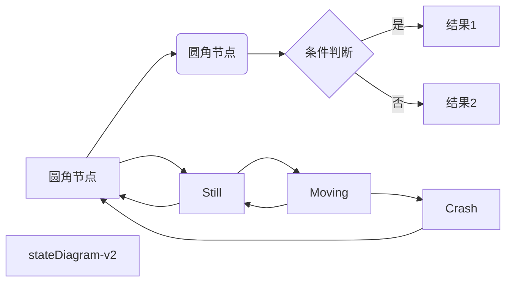
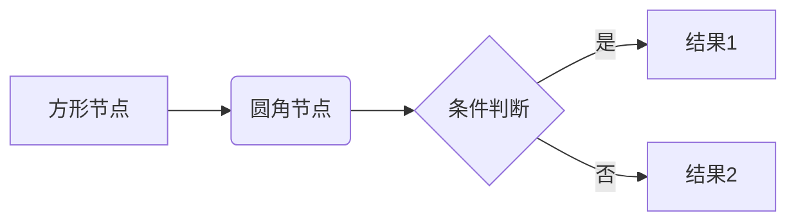

```mermaid 
graph LR
  A[方形节点] --> B(圆角节点)
  B --> C{条件判断}
  C -->|是| D[结果1]
  C -->|否| E[结果2]
stateDiagram-v2
        A[圆角节点] --> Still
        Still --> A[圆角节点]
    
        Still --> Moving
        Moving --> Still
        Moving --> Crash
        Crash --> A[圆角节点]


```

```mermaid
graph LR
  A[方形节点] --> B(圆角节点)
  B --> C{条件判断}
  C -->|是| D[结果1]
  C -->|否| E[结果2]
```

